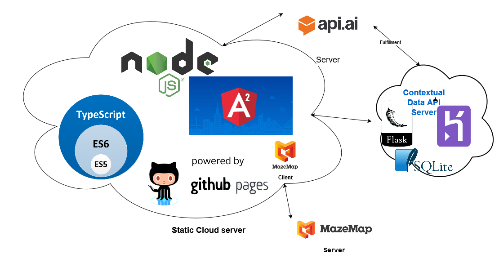
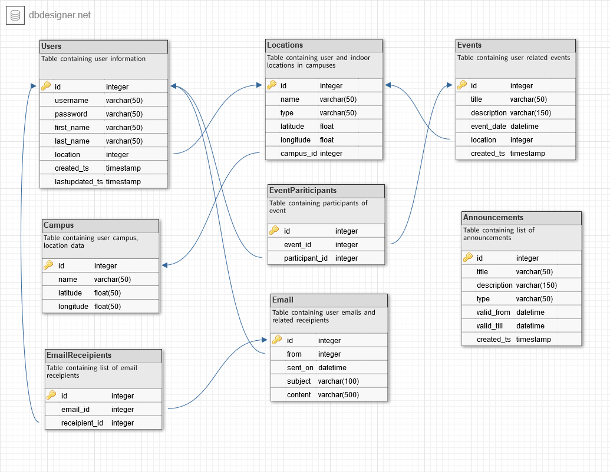

# Donna Backend API server
To bring in contextual references with the existing system at [Donna](http://github.com/rajagopal28/Donna)

## Application Architecture

## Tech stack
- python - Flask, SQLAlchemy
- SQLite

## Backend Schema

## Libraries used
- Flask - application module to serve application with end points
- Flask-SQLAlchemy - ORM module to handle DB responses
- requests - to handle external requests

## Reasons for choosing Flask
- had previous experience with Python Flask
- easy to build api based platform
- quick to setup in mac/linux environments
- good for smaller applications like this

## Steps to run the application
### installing the packages
- `` cd donna-backend ``
- run the command `` pip install --upgrade -r requirements.txt ``
- use `` sudo `` if fails with permission issues

### running server
- `` python run-local.py ``

### running integration tests
- `` python run-tests.py ``

## Technical nuances
 - **Flask:** Have worked with python flask before. It is one of the light weight easy to setup library to create rest api applications in a whip of time. It is reliable, quick to deploy and easy to setup.
 - **SQLite:** Needed a totally light weight easy to load and save backend. SQLite was or first choice. It is a file based system. As our requirement just involved only little amount of data we chose this.
 - **SQL Alchemy:** SQL Alchemy is one of the easy to use backend libraries that goes well with Flask. It helped big time in creating modeling data and associating relationship with less backend code and more ORM python codes.
 - **Heroku:** Free, reliable and easy to setup in both web ui and cli. Even though it is robust it does not really support SQLite in any of its account types. This brought us to the point to add bulk upload and download endpoints for crucial information.
 - **Integration tests:** For the first time in forever, I have written integration test for the service endpoints and integrated as part of the release phase in the heroku dyno. This was made possibile with temporary files and the file based SQLite backend support.
## end points information
### Users
- GET /api/users  - to list all active users
- POST /api/users `` {firstName: .., lastName: .., username:.., password: .., locationId: ..}`` - to add a new user
- POST /api/users/login ``{username:.., password: ..}`` - to add a authenticate and get user token
- GET /api/users/:user-id - to get detail of given user-id
- GET /api/users/download - to download as user info as .json file
- POST /api/users/upload ``{users: FILE_STREAM(users.json)}`` - to upload users from .json file

### Location
- GET /api/locations  - to list all locations
- POST /api/locations ``{name:..., latitude:..., longitude:..., campusId:...}`` - to add a new locations
- GET /api/locations/:location-id - to get detail of given location-id
- GET /api/locations/download - to download as locations info as .json file
- POST /api/locations/upload ``{locations: FILE_STREAM(locations.json)}`` - to upload locations from .json file

### Campus
- GET /api/campus  - to list all campus
- POST /api/campus ``{name:..., latitude:..., longitude:..., campusNumber:...}`` - to add a new campus
- GET /api/campus/:campus-id - to get detail of given campus-id
- GET /api/campus/download - to download as campus info as .json file
- POST /api/campus/upload ``{campus: FILE_STREAM(campus.json)}`` - to upload campus from .json file

### Events
- GET /api/events[?userId=<user-id>]  - to list all events[optional query param to get events of particular user]
- POST /api/events ``{name:..., description:..., eventStart:..., eventEnd:..., eventType:..., eventParticipants:...}`` - to add a new event

### Event Participants
- GET /api/events/:event-id  - to list of all event participants
- POST /api/events/:event-id ``{participants:...}`` - to add a participants to a particular event

### Announcements
- GET /api/announcements  - to list all campus
- POST /api/announcements ``{title:..., description:..., validFrom:..., validtill, category:...}`` - to add a new announcement
- GET /api/announcements/:announcement-id - to get detail of given announcement-id

### Chat Fulfillment
- POST /api/ai/fulfillment  - specific end point to handle api.ai fulfillment hook
`` {
    "lang": "en",
    "status": {
        "errorType": "success",
        "code": 200
    },
    "timestamp": "2017-02-09T16:06:01.908Z",
    "sessionId": "1486656220806",
    "result": {
        "parameters": {
            "city": "Rome",
            "name": "Ana"
        },
        "contexts": [],
        "resolvedQuery": "my name is Ana and I live in Rome",
        "source": "agent",
        "score": 1.0,
        "speech": "",
        "fulfillment": {
            "messages": [
                {
                    "speech": "Hi Ana! Nice to meet you!",
                    "type": 0
                }
            ],
            "speech": "Hi Ana! Nice to meet you!"
        },
        "actionIncomplete": false,
        "action": "greetings",
        "metadata": {
            "intentId": "9f41ef7c-82fa-42a7-9a30-49a93e2c14d0",
            "webhookForSlotFillingUsed": "false",
            "intentName": "greetings",
            "webhookUsed": "true"
        }
    },
    "id": "ab30d214-f4bb-4cdd-ae36-31caac7a6693",
    "originalRequest": {
        "source": "google",
        "data": {
            "inputs": [
                {
                    "raw_inputs": [
                        {
                            "query": "my name is Ana and I live in Rome",
                            "input_type": 2
                        }
                    ],
                    "intent": "assistant.intent.action.TEXT",
                    "arguments": [
                        {
                            "text_value": "my name is Ana and I live in Rome",
                            "raw_text": "my name is Ana and I live in Rome",
                            "name": "text"
                        }
                    ]
                }
            ],
            "user": {
                "user_id": "PuQndWs1OMjUYwVJMYqwJv0/KT8satJHAUQGiGPDQ7A="
            },
            "conversation": {
                "conversation_id": "1486656220806",
                "type": 2,
                "conversation_token": "[]"
            }
        }
    }
} ``

Response format should be as follows as prescribed by API.ai documentation:
`` {
"speech": "Barack Hussein Obama II was the 44th and current President of the United States.",
"displayText": "Barack Hussein Obama II was the 44th and current President of the United States, and the first African American to hold the office. Born in Honolulu, Hawaii, Obama is a graduate of Columbia University   and Harvard Law School, where ",
"data": {...},
"contextOut": [...],
"source": "DuckDuckGo"
}
``

## References
-  https://medium.freecodecamp.org/how-to-host-lightweight-apps-for-free-a29773e5f39e
- https://stackoverflow.com/a/6887071
- https://stackoverflow.com/a/17320579
- https://goonan.io/testing-file-uploads-in-flask/
- http://flask-cors.readthedocs.io/en/latest/#using-json-with-cors
- Python upgrade jinja2 issue : https://stackoverflow.com/a/71647006
- Flask_ext issue for SQLAlchemy import: https://stackoverflow.com/a/55024677
- Another alchemy conflict issue : https://stackoverflow.com/a/73476925
